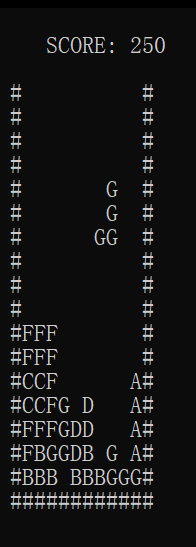

# Tetris
Simple Tetris on Windows Console with cpp.  
|Key|Operation|  
|---|---------|  
|$\leftarrow$|Move left|  
|$\rightarrow$|Move right|  
|$\downarrow$|Move down|  
|Z|Rotate clockwise|  
|X|Rotate counterclockwise|  

# TetrisV1
Same as Tetris.